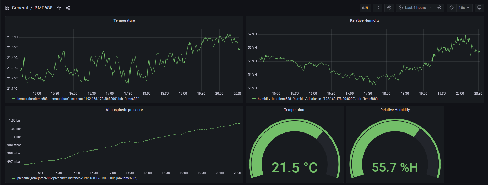

# Bosch BME688/BME680 Prometheus exporter

## This small project is a simple Prometheus exporter for the Bosch BME688/BME680 sensor. The exporter outputs temperature, relative humidity and barometric pressure.


Grafana dashboard with the BME688 sensor values.

## Prerequisites 

```pip3 install bme680 prometheus-client```

## General

The ```bme_exporter.py``` uses the Prometheus client Python lib to expose  Bosch BME688/BME680 sensor metrics on a small HTTP webserver. The data be scraped from ```http://<ip_address>:8000/metrics``` by a Prometheus server.

The ```bme688_exporter.service``` file can be used to run the export as a a systemd service.

The BME688 exporter is based on these projects

* https://github.com/pimoroni/bme680-python
* https://github.com/prometheus/client_python